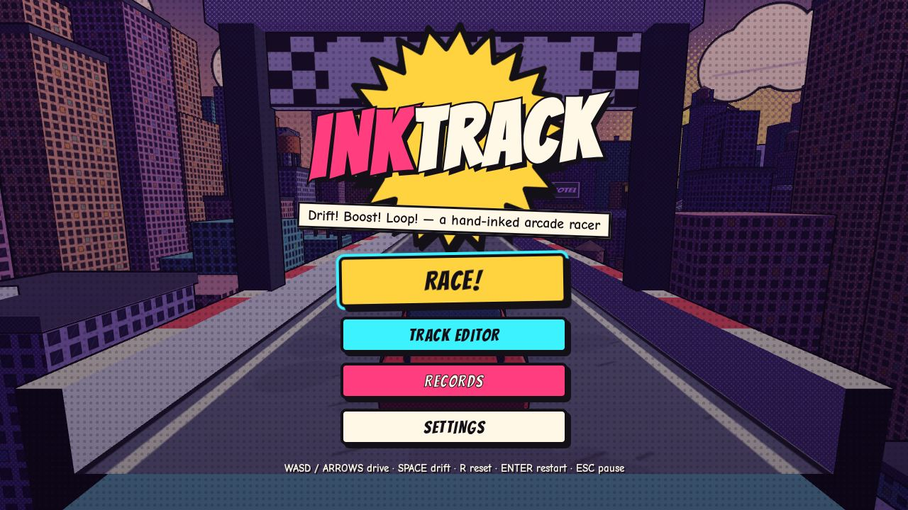
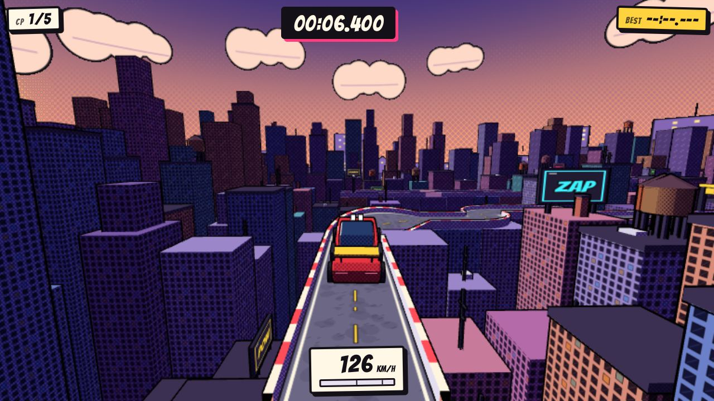
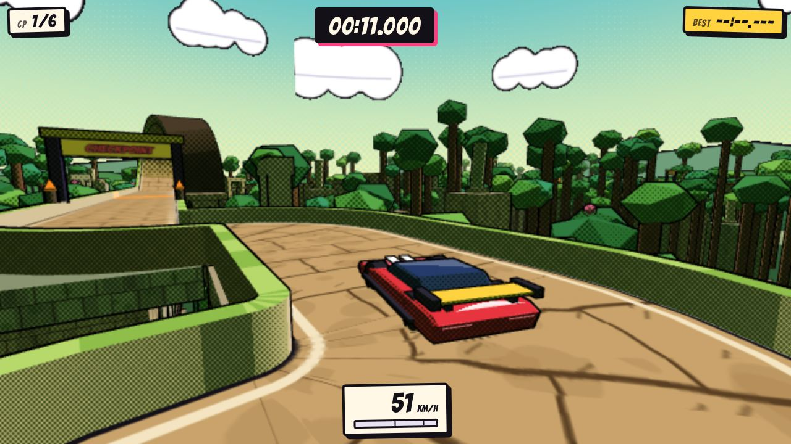
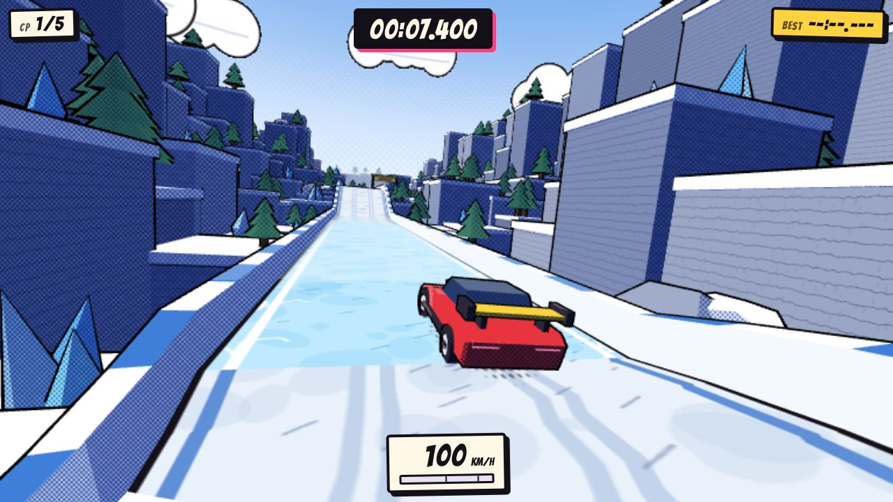
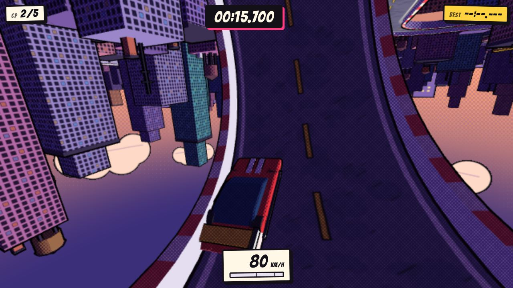
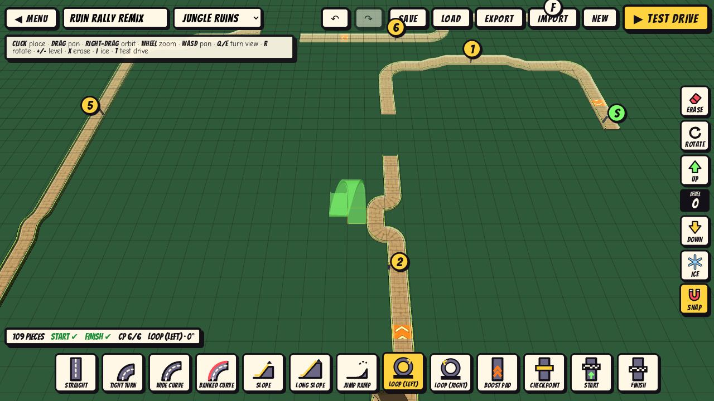
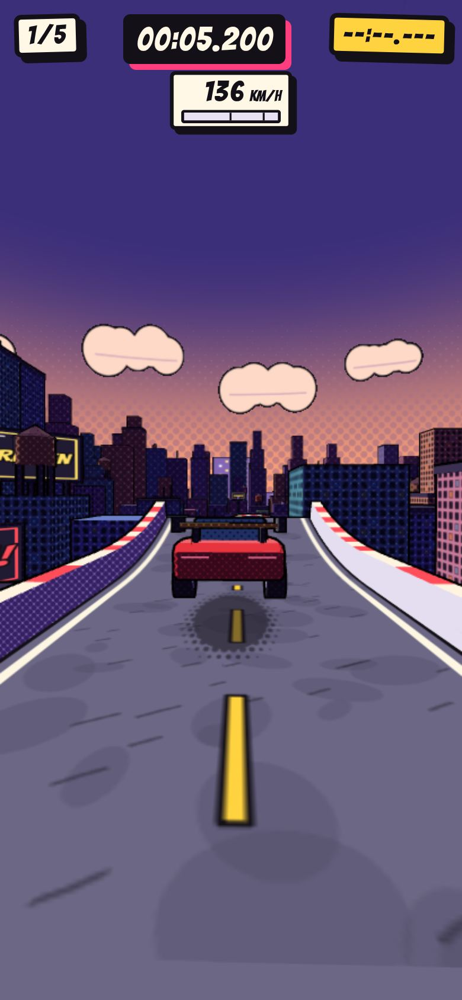

# InkTrack

**A hand-inked, comic-book arcade racer for desktop and mobile browsers.**
Drift, boost, loop and leap across three starter tracks, race your own ghost, and build
your own tracks in the editor. Everything runs client-side, with no server and no
downloads beyond the game itself.

| | |
|---|---|
|  |  |
|  |  |
|  |  |

<p align="center"></p>

## Play

```bash
npm install
npm run dev        # http://localhost:5173
npm run build      # static site in dist/ (relative paths — host anywhere)
npm run preview    # serve the production build on :4173
```

### Controls

| | Desktop | Touch |
|---|---|---|
| Accelerate | `W` / `↑` | **GAS** (or *Auto-accelerate* in Settings) |
| Brake / reverse | `S` / `↓` | **BRAKE** |
| Steer | `A` `D` / `←` `→` | ◀ ▶ zones (slide between them), or *Tilt* in Settings |
| Drift | `Space` / `Shift` (hold while turning) | **DRIFT** |
| Reset to last checkpoint | `R` | ↺ |
| Restart | `Enter` | pause → RESTART |
| Pause | `Esc` / `P` | ❚❚ |

**Drift boost:** hold drift while turning above ~43 km/h. The slide charges a three-tier
meter (blue → orange → pink); let go for a boost of up to 1.4 s.

**Editor:** click/tap to place · drag to pan · right-drag or two-finger twist to orbit ·
wheel/pinch to zoom · `R` rotate · `+`/`−` level · `X` erase · `I` ice · `G` snap ·
`T` test drive · `Ctrl+Z`/`Ctrl+Y` undo/redo · `Ctrl+S` save.

## Features

- **Arcade physics tuned for momentum and drifting.** Loops, banked curves, jump ramps
  and crest launches, forgiving landings, wall scrapes, ice and boost pads. Every feel
  constant lives in [`src/config/physics.js`](src/config/physics.js).
- **Comic rendering in a single pass.** Three-band cel shading, screen-space halftone dots
  in the shadows, inverted-hull ink outlines at a constant pixel width, poster-style
  skylines, speed lines, ink skid marks, smoke puffs and drift sparks, plus
  squash-and-stretch landings.
- **Three starter tracks** with distinct themes: *Rooftop Run* (city at dusk, neon
  signs), *Ruin Rally* (jungle temple causeways) and *Frost Peak* (snowy mountain with
  ice sections).
- **Sequential checkpoints**, a tick-accurate race clock (`mm:ss.mmm`), split deltas,
  and automatic respawn after falls, flips or missed checkpoints.
- **Ghost replay** of your best run on each track, plus a **local top-10 leaderboard**.
- **Track editor** with auto-snap to open road ends, 13 piece types, height levels,
  ice painting, undo/redo, save/load, JSON **export/import** and instant **test drive**.
- **Mobile:** multi-touch controls, optional tilt steering, portrait and landscape
  layouts, and a dynamic-resolution governor.
- **Procedural everything.** Textures, signs, skies and sound effects are generated at
  runtime (canvas + Web Audio). The only asset files are two OFL fonts.

## How it's built

```
src/
  config/     physics.js — every handling constant, documented
  core/       App (mode state machine), GameLoop (fixed 120 Hz sim), seeded RNG
  physics/    CollisionWorld (spatial-hashed triangles), CarPhysics (arcade controller)
  rendering/  toon/halftone/outline shaders, Sky posters, car model & view, effects,
              canvas textures, chase camera, TrackView
  tracks/     piece prefabs, path sweeps, TrackBuilder, Turtle scripts, themes, decor,
              data/ (the three starter tracks)
  race/       Race (rules, timer, checkpoints, respawn), RaceSession, Autopilot, Playground
  replay/     Recorder, GhostPlayer, base64 codec
  storage/    guarded localStorage, records, settings, custom tracks + file format
  editor/     Editor, EditorView (instanced pieces), EditorUI, placement rules, icons
  input/      keyboard, touch (+ tilt), input merging
  ui/         HUD, comic impact bubbles, menus, CSS
  audio/      Web Audio synth SFX
assets/fonts  Bangers + Comic Neue (SIL OFL)
```

**Custom physics instead of cannon-es.** A general rigid-body solver works against this
feel: loops need the car to stick to arbitrary surfaces, thin pieces tunnel at 250 km/h,
and grip and drift can only be tuned indirectly through friction. InkTrack's car is a
point mass with a kinematically aligned chassis. Four wheel rays hold it at ride height
on smoothly interpolated normals, and forces act in the road plane. It costs about 8 ray
casts and 6 sphere tests per tick.

**Inverted-hull outlines instead of a Sobel pass.** Edge detection needs a depth+normal
pre-pass plus a full-screen filter at native resolution. That fill-rate and bandwidth is
exactly what tile-based phone GPUs lack, and it rules out cheap MSAA. The hull adds one
flat-shaded draw per mesh. Halftone is computed in the same toon fragment shader, so there
is no post-processing at all.

**Tracks are data.** Each piece defines footprint cells, connectors and centre-line path
segments. One sweep produces render geometry, collision (with analytic smooth normals)
and the racing line. Starter tracks are *turtle scripts*:

```js
['start'], ['straight', 2], ['boost'], ['wideRight'], ['up2'], ['ramp'],
['gap', 3, -2], ['bankRight'], ['left'], ['right'], ['loopLeft'], ['cp'], ['finish']
```

## Testing & tooling

```bash
npm test                       # 57 unit tests (physics, tracks, replay, editor, storage)
npm run sim -- frost-peak      # headless autopilot lap of any starter track
npm run physics-report         # handling numbers for the current tuning
node scripts/perf.mjs rooftop-run 4   # main-thread profile under 4x CPU throttle
npm run verify                 # in-browser checks (needs `npm run preview` running)
```

The headless simulation is deterministic: the autopilot's browser lap of Rooftop Run
matches the Node run to the millisecond (36.237 s).

**URL flags:** `?track=<id>` · `?autopilot[=aggression]` · `?editor` · `?playground` ·
`?quality=low|medium|high` · `?touch=1` · `?fps` · `?record` (lets autopilot runs set
records). In the console, `INKTRACK.physics` is the live physics config.

See [`docs/DEVLOG.md`](docs/DEVLOG.md) for per-phase notes, trade-offs and the bugs caught
along the way.

## Licenses

Code: MIT. Fonts: [Bangers](assets/fonts/OFL-Bangers.txt) and
[Comic Neue](assets/fonts/OFL-ComicNeue.txt) under the SIL Open Font License 1.1.
Three.js is MIT-licensed.
